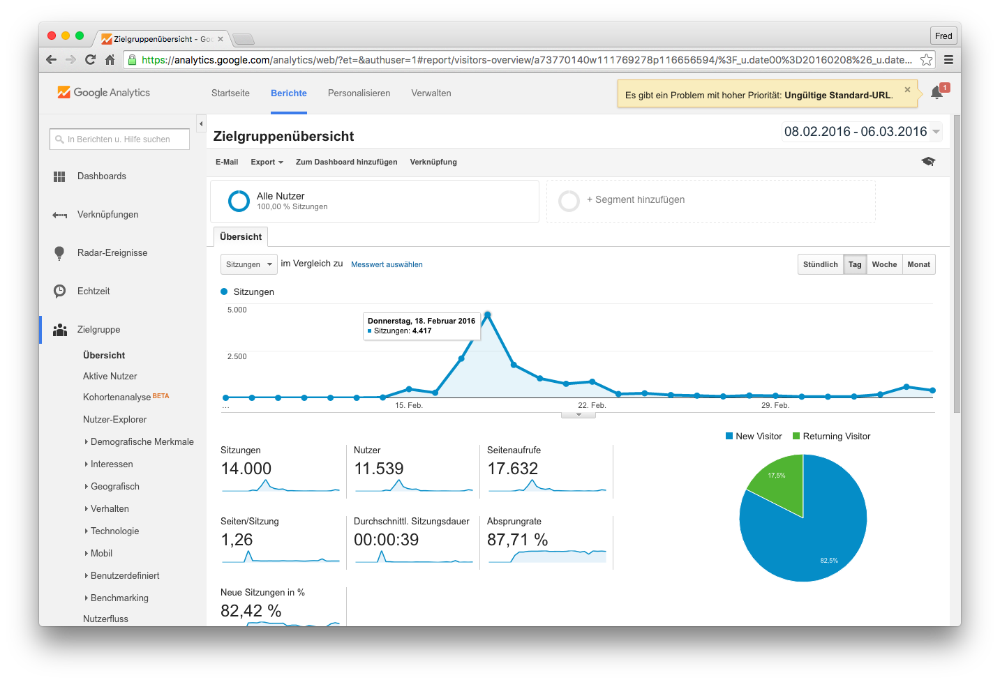
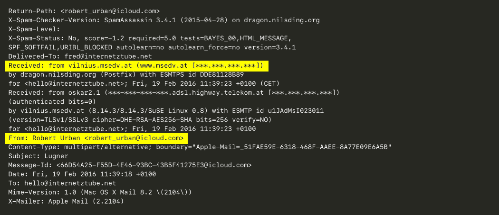
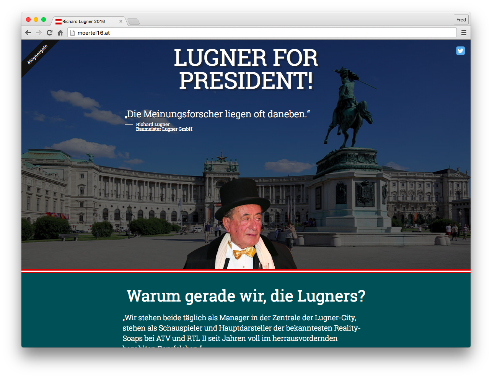
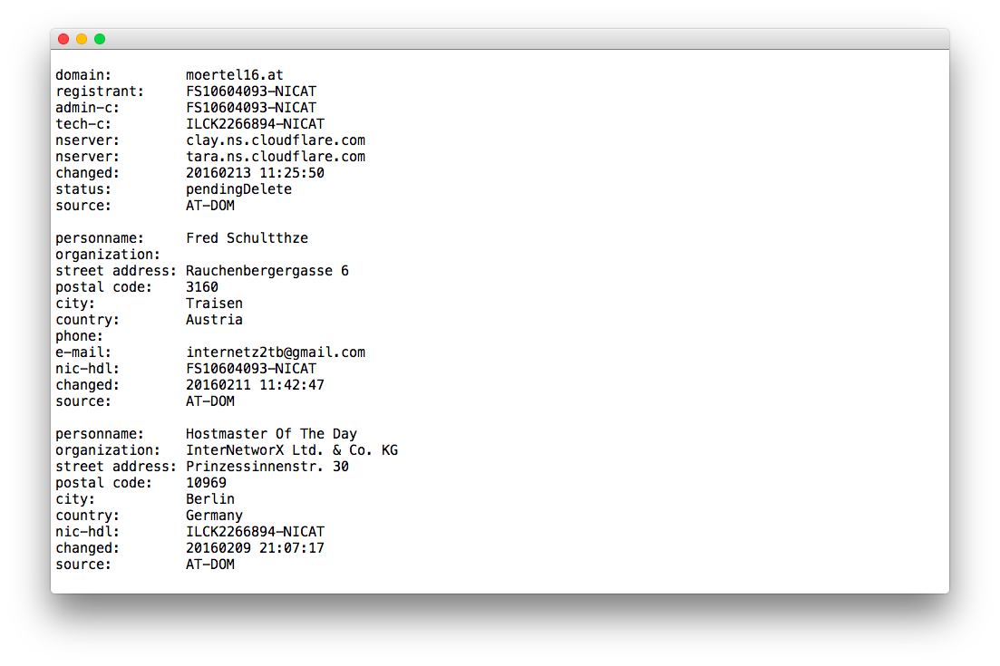

## Affäre moertel16.at

Warum ist die Satire-Seite über den Bundespräsidentschaftskandidaten Richard Lugner offline gegangen?

picture by <a href="https://www.flickr.com/photos/kirksiang/6116479534/">Kirk Siang</a>&nbsp;·&nbsp;CC BY-NC-ND 2.0

  

# Warum ist moertel16.at offline?

Nach jetzt doch fast 6 Wochen nachdem die Seite offline gegangen ist, gebe ich hier eine offizielle Stellungnahme zur Satire-Seite von Bundespräsidentschaftskandidaten BM Richard Lugner ab. Ich möchte hier alle Fakten auf den Tisch legen, damit man den Irrsinn hinter der Geschichte verstehen kann.

Ich habe die Domain am 11.02.16 gekauft und etwa drei Tage danach ist die eigentliche Webseite online gegangen. Die Reaktionen haben nicht lange auf sich warten lassen und so sind in den darauffolgenden drei Tagen vier Medienberichte und rund 18.000 Seitenaufrufe zusammengekommen. Im Großen und Ganzen kann man also sagen, dass die Seite doch einige Leute erreicht hat.

moertel16.at - Google Analytics&nbsp;·&nbsp;Quelle: Internet

  

Auch gerade deswegen habe ich auf eine Reaktion des Baumeister gewartet. Verwundet hat mich aber doch, dass es bis zum 19.02.16 gedauert hat bis ich eine, wenn nicht ganz offiziell wirkende, E-Mail erhalten habe.

---

Von: "Robert Urban" <robert_urban@icloud.com>  
An: "hello@internetztube.net" <hello@internetztube.net>  
Datum: 19. Februar 2016 11:39 Uhr  
Betreff: Lugner
  

Sehr geehrter Herr Kober!

Wären Sie bereit, die Moertel16.at Homepage gegen ein Abstandshonorar aus dem Netz zu nehmen? Ich schlage € 10.000,— vor.

Mit freundlichen Grüßen
Robert Urban

---

Nicht nur, dass der werte Herr Urban meinen Nachnamen falsch geschrieben hat, auch hatte dieser wahrscheinlich auch nicht die Absicht eine Antwort zu erhalten. Wenn man sich den Header von der E-Mail einmal etwas genauer ansieht, dann bemerkt man schnell, dass diese nicht von einem Apple-Server, sondern von einem Server bei msedv.at versandt worden ist.

Kurzerhand habe mich auf die Webseite von msedv.at begeben und mich da etwas genauer umgesehen. &lt;ironie&gt;Neben den supermodernen, einzigartigen und bestimmt auch super sicheren Tools wie einem <a href="https://www.msedv.at/tools/cctest/" target="_blank">Kreditkartenchecker</a> oder einem <a href="https://www.msedv.at/tools/passwortgenerator/" target="_blank">Passwortgenerator</a>&lt;/ironie&gt; bin ich auch auf das Impressum gestoßen. In diesem steht drinnen, dass ein Herr "Dipl.-Ing. Markus Schwaiger" dieses Unternehmen führt.

Wenn man eine simple Google Suche nach dem Herrn Schwaiger durchführt, dann sieht man recht schnell, dass der nicht nur ein IT-, sondern auch einige andere Unternehmen führt. Wie zum Beispiel eine Werbeagentur, die anscheinend noch auf Table-Layouts setzt (<a href="http://www.media5.at/" target="_blank">media5.at</a>), ein Personenschutzunternehmen namens <i>counterforce</i> (<a href="http://counterforce.at/" target="_blank">counterforce.at</a>) und&nbsp;ein Detektivunternehmen namens MSI (<a href="http://msi.at/" target="_blank">msi.at</a>).

Davon habe ich mich aber nicht irritieren lassen und dem Herrn Urban eine Antwort gesendet.

---

Von: "fred@internetztube.net" &lt;fred@internetztube.net&gt; 
An: "Robert Urban" &lt;robert_urban@icloud.com&gt; 
Datum: 19. Februar 2016 12:35 Uhr 
Betreff: Re: Lugner 

Sehr geehrter Herr Urban,  
besten Dank für Ihre Anfrage! Meine Satire-Seite "moertel16.at" hat in den vergangenen Tagen für ein großes Maß an öffentlichem Interesse gesorgt. Gerne bin ich bereit, mit Ihnen über ein mögliches "Offline-Nehmen" meiner Website zu sprechen. Das von Ihnen veranschlagte Honorar entspricht nicht meinen finanziellen Vorstellungen. Trotzdem bin ich optimistisch, dass wir uns auf einen Betrag einigen können. 
Bevor wir uns allerdings über Details austauschen, würden mich genauere Angaben zu ihrer Person und dem Grund Ihrer Anfrage interessieren. Gerne können Sie mich auch anrufen unter der Nummer: +43 *** *** ** **   
Mit freundlichen Grüßen, 
Frederic Köberl

---

moertel16.at&nbsp;·&nbsp;Quelle: Internet

  

Natürlich sind €10.000,- eine Menge Geld, wollte aber gegenüber dem Herrn Urban nicht klein beigeben und auch keine fixe Zusage machen, sondern habe um ein unverbindliches Telefonat gebeten.

Mich hat dennoch verwundert, dass die E-Mail trotz des getürkten Headers von der ursprünglichen E-Mail nicht abgewiesen wurde. Ergo, die E-Mail muss rein theoretisch angekommen sein, ganz sicher kann man aber nicht sein.
Eine Antwort habe ich bis zum heutigen Tage nicht erhalten.

# $ whois moertel16.at

Die Zeit ist ins Land gezogen und ich habe die Seite nach der Zeit aus den Augen verloren. Doch als auf einmal die Seite offline gegangen ist, war die Thematik wieder am Tisch.

Als erstes checkte ich den Server, ob er wieder einen DDoS-Angriff, wie in den ersten Tagen, ausgesetzt ist. Das war aber nicht der Fall. Als nächstes checkte ich die Domain und musste feststellen, dass diese den Status "DELETE INITIATED" erhalten hat. Da mir dies an einem Wochenende aufgefallen ist, konnte ich natürlich nicht viel machen, da der Service bei nic.at nur an Wochentagen online ist.

Am Montag Vormittag habe ich schließlich bei nic.at angerufen und habe diese gebeten mir eine E-Mail zu schreiben, was ich tun muss um die Domain wieder online zu bringen.

--- 

Von: nic.at Rechtsabteilung &lt;recht@nic.at&gt; 
An: "internetz2tb@gmail.com" &lt;internetz2tb@gmail.com&gt; 
Datum: 19. Februar 2016 12:35 Uhr 
Betreff: Re: Lugner 

Sehr geehrter Herr Schultthze,  
zurückkommend auf Ihr Telefonat teile ich Ihnen mit, wie Sie die Adressen-Änderung bei nic.at durchführen können:  
1. Nachweis dass Ihr Name und Adresse stimmt --&gt; diesbezüglich senden Sie uns bitte einen Melderegisterauszug. 
2. Nach erfolgter Prüfung Ihrer Unterlagen, können wir die Domain wieder aufsperren. 
3. Sobald die Domain wieder freigegeben ist, müssen Sie uns SOFORT einen Online-Auftrag für die Änderung der Adresse senden  

Weiters möchte ich Sie darauf hinweisen, dass sich bereits eine Anwaltskanzlei in Anwaltlicher Vertretung von Herrn BM Ing. Richard Lugner - mit uns in Verbindung gesetzt hat. 
D.h., sollte Ihre Domain wieder aufgesperrt werden und die Inhaberdaten richtig gestellt sein, wir diesen über die Änderung informieren müssen.
  
Mit freundlichen Grüßen 
nic.at Rechtsabteilung

--- 

**Disclaimer:** 
Beim Registrieren der Domain war ich mir unsicher, ob ich mich als Privatperson eher im Hintergrund oder im Rampenlicht aufhalten solle. Deswegen habe ich die Domain mit falschen Personenangaben angemeldet. Wie sich aber herausstellen soll war das nicht einmal eine so blöde Idee.  
Hier im Screenshot sieht man die Daten, die ich bei der Anmeldung angegeben habe.

whois moertel16.at&nbsp;·&nbsp;Quelle: <a href="https://webm.rrerr.net/#DNS" target="_blank">DNS</a>

  

Nachdem ich die E-Mail gelesen habe, war ich doch erleichtert, dass ich vorerst keine Probleme mit dem Baumeister bekommen werde. Auf der anderen Seite wollte ich wissen, wie es nic.at geschafft hat meine falschen Angaben zur Domain zu entlarven.

Nach intensiver Recherche habe ich dann herausgefunden, dass nic.at bei der erstmaligen Anfrage der Kontaktdaten einer Domain einen eingeschriebenen Brief an die angegebene Adresse sendet. Wenn der Brief erfolgreich zugestellt wird, dann sind die Angaben gültig, andernfalls nicht.

Wenn der Anwalt oder vielleicht auch Herr Schwaiger diesen Mechanismus kennen, dann muss ich deren kluge Vorgehensweise belobigen. Andererseits wäre es vielleicht doch klüger gewesen sich an die E-Mail-Adresse zu wenden, die im Impressum gestanden ist. So hätte man sich auf einen Konsens einigen können.

Dennoch muss ich sagen, dass es vom Baumeister doch etwas naiv war zu denken, dass eine Satire-Seite nur schaden kann. Man hätte sich darauf verständigen können, dass er die Webseite als Instrument für seinen Wahlkampf verwenden kann. Die Mörtel Jukebox mit den legendären Sagern des Baumeisters ist jedenfalls sehr gut angekommen und hätte man sicher auch Lugner-freundlicher gestalten können.

Abschließend möchte ich sagen, dass es sich für den Baumeister sicher nicht gerechnet hat einen Detektiv zu engagieren, der nicht mal weiß wie man seine Identität richtig verschleiert.

Wer <i>moertel.at</i> noch nicht gesehen hat kann sich entweder die Seite von GitHub (<a href="https://github.com/internetztube/moertel16-at" target="_blank">internetztube/moertel16-at</a>) herunterladen oder sich diese auf <a href="http://xyz.bsnss.biz/moertel/public" target="_blank">http://xyz.bsnss.biz/moertel/</a> ansehen.

## Medienecho

### Heute.at
<a target="_blank" href="http://www.heute.at/news/politik/Satire-Seite-zieht-Lugner-durch-den-Kakao;art23660,1259745">

Satire-Seite zieht Lugner durch den Kakao

</a>

### derStandard.at

<a target="_blank" href="https://derstandard.at/2000031435148/Jukebox-auf-moertel16at-spielt-kuriose-Lugner-Zitate">

"Jukebox" auf moertel16.at spielt kuriose Lugner-Zitate

</a>
<a target="_blank" href="https://derstandard.at/2000031442632-2000005810778/Satire-Jukebox-Bettel-Tweets">

"Satire-Jukebox &amp; Bettel-Tweets

</a>

### Energy.at
<a target="_blank" href="http://www.energy.at/home/stories/stars/6653/Mrtel-Jukebox">

Mörtel Jukebox

</a>

### Kronen Zeitung
<a target="_blank" href="http://www.krone.at/Digital/Praesidentenwahl_Satire-Seite_narrt_Richard_Lugner-moertel16.at-Story-496717">

Präsidentenwahl: Satire-Seite narrt Richard Lugner

</a>

### Domain Alliance
<a target="_blank" href="http://www.domainalliance.de/allgemein/wieder-eine-lugner-domain/">

Wieder eine Lugner-Domain

</a>

--- 
Wenn noch Fragen bestehen sollten, dann diese bitte an <a href="mailto:frederic.koeber+moertel@gmail.com">frederic.koeberl@gmail.com</a>.

<a href="https://raw.githubusercontent.com/internetztube/internetztube/master/projects/affaere-moertel16-at/fragen.mp3" target="_blank">Sound</a>

--- 

**Frederic Köberl**: "Wen würden Sie beauftragen um wieder eine Satire-Seite offline zu nehmen?"

**Richard Lugner**: <a href="https://raw.githubusercontent.com/internetztube/internetztube/master/projects/affaere-moertel16-at/niemanden.mp3" target="_blank">Sound</a>

---

Frederic Köberl, am 08. Mai 2016 
<a href="https://twitter.com/internetztube/">@internetztube</a>

  

--- 
**Projects**:&nbsp; [Affäre moertel16.at (German)](https://github.com/internetztube/internetztube/blob/master/projects/affaere-moertel16-at/index.md#content-start) &nbsp;&nbsp;&nbsp;&nbsp;·&nbsp;&nbsp;&nbsp;&nbsp; [Ö3 Statistic Statement (German)](https://github.com/internetztube/internetztube/blob/master/projects/oe3-statistics/index.md#content-start)  
**Talks**:&nbsp;&nbsp;&nbsp;&nbsp;&nbsp;&nbsp;[Hacker hassen diese Tricks! (German)](https://github.com/internetztube/internetztube/blob/master/talks/hacker-hassen-diese-tricks/index.md#content-start)

 

[Unsplash](https://unsplash.com/@internetztube)
&nbsp;·&nbsp;
[Twitter](https://twitter.com/internetztube)
&nbsp;·&nbsp;
[LinkedIn](https://linkedin.com/in/koeberl)
&nbsp;·&nbsp;
[Telegram](https://telegram.me/internetztube)
&nbsp;·&nbsp;
[eMail](mailto:please-no-spam--thanks@frederickoeberl.com)

