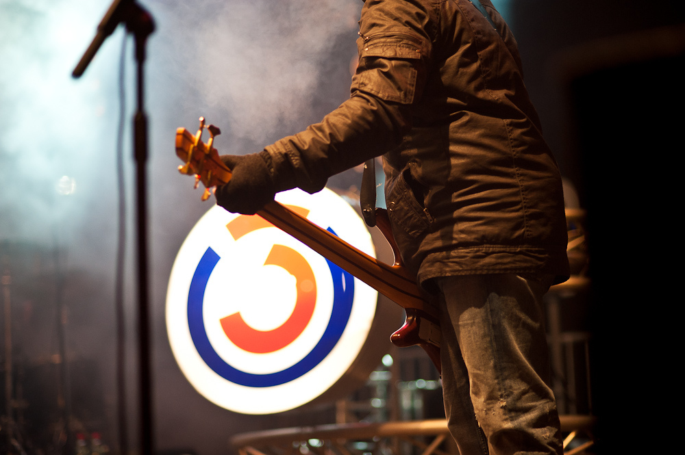

## Ö3 Statistik

Wie oft wiederholen sich die Songs beim Ö3?

picture by <a href="https://www.flickr.com/photos/roman581/5253603015/" class="c-link--inverted hero-bottomLink hero-bottomLink--left" target="_blank">Roman Pfeiffer
</a>&nbsp;·&nbsp;CC BY-ND 2.0

  

# Stellungnahme

Liebe Leute,

ich danke Euch für euer positives Feedback und euren unglaublichen Zuspruch! Ich habe mich nun aber dazu entschlossen, meine Daten offline zu nehmen. Der Grund: <a href="https://www.facebook.com/oe3/">Hitradio Ö3</a>  hat mich in einem Schreiben genau darum gebeten. Meine Statistik habe "das Potential als unternehmensschädlich eingestuft zu werden".
 
Ich bitte euch um Verständnis.

Wenn noch Fragen bestehen könnt ihr mich gerne via <a href="https://twitter.com/internetztube">Twitter</a> oder per Email <a href="mailto:frederic.koeberl@gmail.com">frederic.koeberl@gmail.com</a> erreichen.

Euer Fred.

## Mail

Sehr geehrter Herr Köberl!

Vielen Dank für Ihre Facebook-Nachricht an Ö3. Wir kennen Ihre Webseite schon seit langem. Wir sind damit nicht glücklich, weil es sich um keine offizielle Statistik handelt (wie sie z.B. die AKM erstellt). Insbesondere zum Punkt, welche Musiker als österreichische Künstler einzustufen sind, haben wir sehr genaue und umfassende Festlegungen in Abstimmung mit den Vertretern der Musiker getroffen, die Sie nicht kennen (können). Daher stimmen Ihre Zahlen nicht mit den offiziellen Auswertungen überein. Da wir unsere Metadaten (Titel, Interpret, Moderator, etc.) als Service für unsere Hörer/-innen bewusst veröffentlichen, wissen wir, dass jemand auch mit geringen Programmierkenntnissen diese Daten jederzeit auswerten kann – und, dass das auch immer wieder gemacht wird.

Ob jemand das Recht hat, diese Daten wieder ins Netz zu stellen, wäre rechtlich genau zu prüfen. Ihre Webseite hätte womöglich das Potential als unternehmensschädigend eingestuft zu werden. Haben Sie bitte Verständnis dafür, dass wir diesen Veröffentlichungen daher ausdrücklich nicht zustimmen und, dass wir Ihre Daten, wie schon ausgeführt, inhaltlich in Frage stellen. Wir möchten Sie daher ersuchen, Ihre „Ö3-Seite“ wieder offline zu nehmen.

Mit freundlichen Grüßen

Bakk.phil. Albert Malli 
Stv. Ö3-Senderchef - Leitung Neue Medien & Administration

## Medienecho

### Vice
<a target="_blank" href="https://noisey.vice.com/alps/blog/oe3-anteil-oesterreichische-musik-inoffizielle-senderstatistik-293">

Wie viel österreichische Musik spielt Ö3 denn jetzt wirklich?

</a>

von Viktor Sohm, Jonas Vogt

### Volume
<a target="_blank" href="http://www.volume.at/magazin/kategorie-uebersicht/detailansicht/m05/5546/detail/">

Radio Ö3 2015: 7% Musik aus Österreich, "Chrerleader" meistgespielter Song

</a>

von Daniel Kubera

### thegap
<a target="_blank" href="http://www.thegap.at/musikstories/artikel/7-fakten-zur-hitradio-oe3-sendestatistik/">

7 Fakten zur Hitradio Ö3 Sendestatistik

</a>

von Pia Gärtner, Stefan Niederwieser

